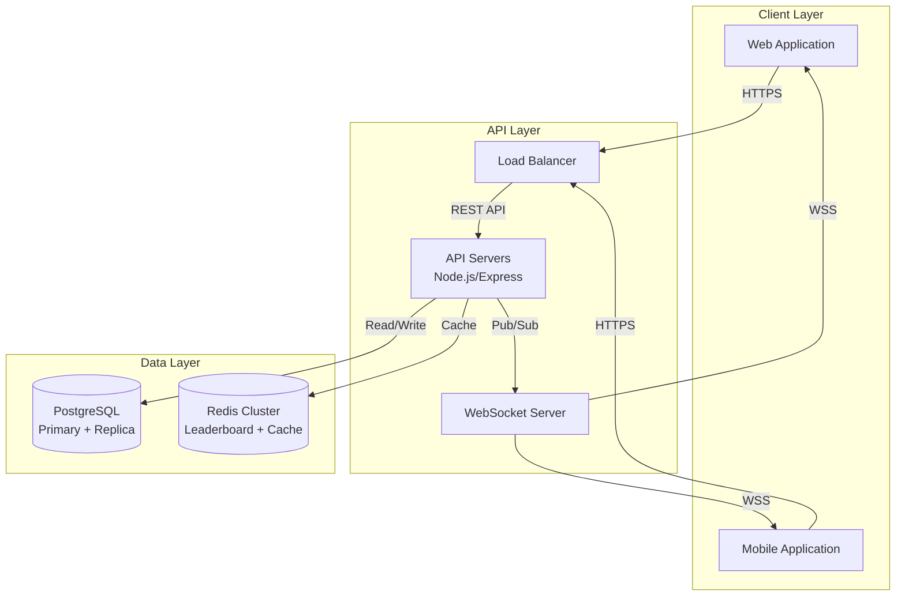

# Scoreboard Live Update API

&gt; Technical specification for real-time scoreboard system with fraud-resistant action processing.

## Quick Navigation

| Section | Description | Status |
|---------|-------------|--------|
| [Overview](docs/01-overview.md) | System goals & scope | ✅ Complete |
| [Data Model](docs/02-data-model.md) | PostgreSQL + Redis schemas | ✅ Complete |
| [API Reference](docs/03-api-reference.md) | Endpoints & WebSocket protocol | ✅ Complete |
| [Security](docs/04-security.md) | Threat model & mitigations | ✅ Complete |
| [Execution Flows](docs/05-execution-flows.md) | Logic & sequence diagrams | ✅ Complete |
| [Operations](docs/06-operations.md) | Deployment & monitoring | ✅ Complete |
| [Improvements](docs/07-improvements.md) | Future roadmap | ✅ Complete |

## Executive Summary

This specification defines a backend system for a live-updating scoreboard displaying top 10 user scores. The system handles score-increasing actions with strict security measures to prevent unauthorized manipulation.

### Key Requirements
- **Real-time updates**: Sub-second latency for scoreboard changes
- **Top 10 display**: Efficient ranking queries
- **Fraud prevention**: Cryptographic verification of all actions
- **Scalability**: Support 10,000+ concurrent users

### Architecture Overview

## Core Technologies
| Component  | Technology            | Justification                    |
| ---------- | --------------------- | -------------------------------- |
| API Server | Node.js + Express     | Event-driven, high concurrency   |
| Database   | PostgreSQL 14+        | ACID compliance, complex queries |
| Cache      | Redis 7+              | Sorted sets for O(log N) ranking |
| Real-time  | WebSocket (Socket.io) | Bidirectional, fallback support  |
| Security   | JWT + HMAC-SHA256     | Industry standard, stateless     |

## Document Conventions
  - MUST: Required for implementation
  - SHOULD: Recommended but optional
  - MAY: Optional enhancement
  - code: Technical terms or file names
  - italic: Emphasis or notes
## Contact
For questions or clarifications, contact **Dev. Fares Bader**.
  - Document Version: 1.0.0
  - Last Updated: 2025-02-20
  - Status: Ready for Engineering Review
