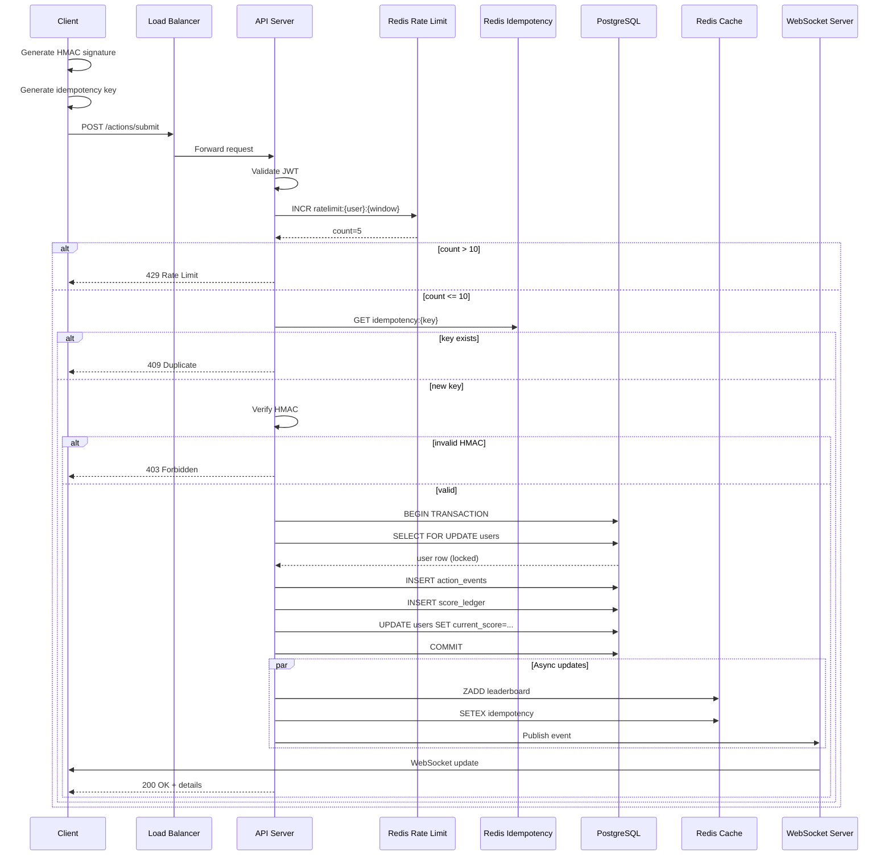

<div align="center">

| [← Security](04-security.md) | [Next: Operations →](06-operations.md) |
</div>

# 5. Execution Flows

## 5.1 Action Submission Sequence


<details>
<summary>🔧 View Mermaid Source (for editing)</summary>


</details>

## 5.2 Pseudocode: Action Handler

``` javascript 
async function submitAction(request) {
  // 1. Generate trace ID
  const requestId = generateUUID();
  
  // 2. Rate limiting (Redis)
  const rateKey = `ratelimit:${userId}:${minuteWindow()}`;
  const count = await redis.incr(rateKey);
  if (count === 1) await redis.expire(rateKey, 60);
  if (count > 10) throw new RateLimitError(429);
  
  // 3. Idempotency check (Redis fast path)
  const idemKey = request.headers['X-Idempotency-Key'];
  const existing = await redis.get(`idempotency:${idemKey}`);
  if (existing) return {status: 'duplicate', event_id: existing};
  
  // 4. HMAC verification
  const signature = request.headers['X-Action-Signature'];
  const expected = calculateHMAC(request.body, userSecret);
  if (!timingSafeEqual(signature, expected)) {
    await logSecurityEvent('INVALID_HMAC', request);
    throw new ForbiddenError(403);
  }
  
  // 5. Timestamp validation
  const clientTime = new Date(request.body.client_timestamp);
  if (Math.abs(clientTime - Date.now()) > 120000) {
    throw new BadRequestError('INVALID_TIMESTAMP');
  }
  
  // 6. Database transaction (ACID)
  const result = await db.transaction(async (trx) => {
    // Lock user row
    const user = await trx('users')
      .where('user_id', userId)
      .forUpdate()
      .first();
    
    // Insert event (idempotency guaranteed by UNIQUE constraint)
    const event = await trx('action_events').insert({
      user_id: userId,
      action_type: request.body.action_type,
      action_idempotency_key: idemKey,
      payload_hash: sha256(JSON.stringify(request.body)),
      points_awarded: calculatePoints(request.body),
      client_timestamp: request.body.client_timestamp,
      server_timestamp: new Date(),
      verification_method: 'HMAC',
      ip_address: request.ip,
      user_agent: request.headers['user-agent']
    }).returning('*');
    
    // Immutable ledger entry
    await trx('score_ledger').insert({
      user_id: userId,
      event_id: event.event_id,
      previous_score: user.current_score,
      new_score: user.current_score + event.points_awarded,
      delta: event.points_awarded
    });
    
    // Update denormalized cache
    const updated = await trx('users')
      .where('user_id', userId)
      .update({
        current_score: user.current_score + event.points_awarded,
        total_actions: user.total_actions + 1,
        updated_at: new Date()
      })
      .returning('*');
    
    return {event, user: updated, previousScore: user.current_score};
  });
  
  // 7. Update Redis (async, non-blocking)
  const pipeline = redis.pipeline();
  pipeline.zadd('leaderboard:global', result.user.current_score, userId);
  pipeline.setex(`idempotency:${idemKey}`, 86400, result.event.event_id);
  const [_, __, rankResult] = await pipeline.exec();
  const newRank = await redis.zrevrank('leaderboard:global', userId);
  
  // 8. Broadcast (fire-and-forget)
  websocket.broadcast('user.score_update', {
    user_id: userId,
    new_score: result.user.current_score,
    delta: result.event.points_awarded,
    new_rank: newRank + 1
  });
  
  // 9. Return response
  return {
    request_id: requestId,
    status: 'accepted',
    data: {
      event_id: result.event.event_id,
      score_update: {
        previous_score: result.previousScore,
        new_score: result.user.current_score,
        delta: result.event.points_awarded,
        new_rank: newRank + 1
      }
    }
  };
}
```
### 5.3 Leaderboard Retrieval Flow

``` javascript

async function getLeaderboard(limit = 10, userId) {
  // 1. Try Redis first (O(log N + M))
  const topUsers = await redis.zrevrange(
    'leaderboard:global', 
    0, 
    limit - 1, 
    'WITHSCORES'
  );
  
  // 2. Redis miss: query PostgreSQL
  if (!topUsers || topUsers.length === 0) {
    const dbResults = await db('users')
      .select('user_id', 'username', 'current_score')
      .orderBy('current_score', 'desc')
      .limit(limit);
    
    // Rebuild Redis cache async
    rebuildLeaderboardCache().catch(console.error);
    return formatResponse(dbResults);
  }
  
  // 3. Enrich with user details
  const userIds = topUsers.filter((_, i) => i % 2 === 0);
  const userDetails = await db('users')
    .whereIn('user_id', userIds)
    .select('user_id', 'username');
  
  // 4. Get requester position
  let userPosition = null;
  if (userId) {
    const [rank, score] = await Promise.all([
      redis.zrevrank('leaderboard:global', userId),
      redis.zscore('leaderboard:global', userId)
    ]);
    userPosition = {
      rank: rank + 1,
      score: parseInt(score),
      percentile: calculatePercentile(rank, totalUsers)
    };
  }
  
  return {
    leaderboard: mergeScoresWithUsers(topUsers, userDetails),
    user_position: userPosition,
    meta: {cache_status: 'hit', ttl_seconds: 5}
  };
}
```
